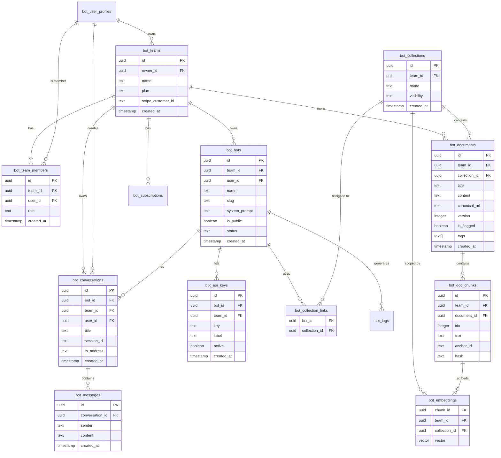

# 🏗️ Technical Architecture Documentation

**Last Updated:** November 3, 2025  
**Status:** Day 2 - Architecture & Schema Design  
**Related:** [90-Day Todo](./90-day-todo.md) | [Roadmap](./roadmap.md) | [Security Spec](./security.md)

---

## 📋 Table of Contents

1. [Architecture Overview](#architecture-overview)
2. [Database Schema Analysis](#database-schema-analysis)
3. [Team ID Propagation Strategy](#team-id-propagation-strategy)
4. [Entity Relationship Diagrams](#entity-relationship-diagrams)
5. [Data Flow Diagrams](#data-flow-diagrams)
6. [Migration Considerations](#migration-considerations)

---

## Architecture Overview

### High-Level System Architecture

```
┌─────────────────────────────────────────────────────────────────┐
│                        Frontend (Next.js)                        │
│  ┌──────────────┐  ┌──────────────┐  ┌──────────────┐          │
│  │  Dashboard   │  │  Chat UI     │  │  Widget      │          │
│  │  (app/dash)  │  │  (app/chat)  │  │  (embed.js)  │          │
│  └──────────────┘  └──────────────┘  └──────────────┘          │
└─────────────────────────────────────────────────────────────────┘
                              │
                              │ HTTP/API Routes
                              ▼
┌─────────────────────────────────────────────────────────────────┐
│                     Backend API Layer                            │
│  ┌──────────────┐  ┌──────────────┐  ┌──────────────┐          │
│  │  Auth API    │  │  Chat API    │  │  Docs API    │          │
│  │  (Supabase)  │  │  (SSE Stream)│  │  (Upload)    │          │
│  └──────────────┘  └──────────────┘  └──────────────┘          │
└─────────────────────────────────────────────────────────────────┘
                              │
                              │ Row Level Security (RLS)
                              ▼
┌─────────────────────────────────────────────────────────────────┐
│                   Database Layer (Supabase)                      │
│  ┌──────────────┐  ┌──────────────┐  ┌──────────────┐          │
│  │   Postgres   │  │  pgvector    │  │   Storage    │          │
│  │  (Tables)    │  │  (Embeddings)│  │  (Files)     │          │
│  └──────────────┘  └──────────────┘  └──────────────┘          │
└─────────────────────────────────────────────────────────────────┘
                              │
                              │ API Calls
                              ▼
┌─────────────────────────────────────────────────────────────────┐
│                    External Services                             │
│  ┌──────────────┐  ┌──────────────┐  ┌──────────────┐          │
│  │    OpenAI    │  │    Stripe    │  │   Sentry     │          │
│  │  (GPT + Emb) │  │  (Billing)   │  │  (Monitoring)│          │
│  └──────────────┘  └──────────────┘  └──────────────┘          │
└─────────────────────────────────────────────────────────────────┘
```

### Multi-Tenancy Isolation Model

The system uses a **tenant-per-team** model where:

- Each `team` is an isolated tenant
- All resources (bots, documents, conversations) are scoped by `team_id`
- Row Level Security (RLS) policies enforce isolation at the database level
- API routes resolve user → team context server-side

---

## Database Schema Analysis

### Current Schema State

Based on the current Supabase schema audit, the following tables exist:

#### Core User & Team Tables

**Table: `bot_user_profiles`**

- Primary key: `id` (uuid, references Supabase Auth users)
- Contains user profile information
- **MISSING:** Direct `team_id` reference (users will join teams via `bot_team_members`)

**Expected Table: `bot_teams`** ⚠️ **NOT YET CREATED**

```sql
bot_teams(
  id uuid PRIMARY KEY,
  owner_id uuid REFERENCES bot_user_profiles(id),
  name text NOT NULL,
  plan text DEFAULT 'free',
  stripe_customer_id text,
  created_at timestamp DEFAULT now()
)
```

**Expected Table: `bot_team_members`** ⚠️ **NOT YET CREATED**

```sql
bot_team_members(
  id uuid PRIMARY KEY,
  team_id uuid REFERENCES bot_teams(id),
  user_id uuid REFERENCES bot_user_profiles(id),
  role text DEFAULT 'member', -- 'owner', 'admin', 'member'
  created_at timestamp DEFAULT now(),
  UNIQUE(team_id, user_id)
)
```

#### Bot Management Tables

**Table: `bot_bots`**

- Primary key: `id` (uuid)
- Foreign keys: `user_id` (uuid, nullable)
- Contains bot configuration (name, slug, system_prompt, status)
- **MISSING:** `team_id` column (currently user-scoped only)

**Required Changes:**

- Add `team_id uuid REFERENCES bot_teams(id) NOT NULL`
- Migrate existing `user_id` → `team_id` (assign each user to a default team)
- Update RLS policies to filter by `team_id`

**Table: `bot_api_keys`**

- Primary key: `id` (uuid)
- Foreign keys: `bot_id` (uuid, nullable), `user_id` (uuid, nullable)
- Stores API keys for bot access
- **MISSING:** `team_id` column

**Required Changes:**

- Add `team_id uuid REFERENCES bot_teams(id) NOT NULL`
- Derive `team_id` from `bot_id` via JOIN or denormalize
- Update RLS policies

#### Document Management Tables

**Expected Table: `bot_collections`** ⚠️ **NOT YET CREATED**

```sql
bot_collections(
  id uuid PRIMARY KEY,
  team_id uuid REFERENCES bot_teams(id) NOT NULL,
  name text NOT NULL,
  visibility text DEFAULT 'private', -- 'private', 'team', 'public'
  created_at timestamp DEFAULT now()
)
```

- **Purpose:** Groups documents for organization and bot assignment (follows `bot_` prefix convention)
- **Required:** Create new table with `team_id` for multi-tenancy

**Expected Table: `bot_collection_links`** ⚠️ **NOT YET CREATED**

```sql
bot_collection_links(
  bot_id uuid REFERENCES bot_bots(id),
  collection_id uuid REFERENCES bot_collections(id),
  PRIMARY KEY (bot_id, collection_id)
)
```

- **Purpose:** Junction table linking bots to collections (many-to-many relationship)
- **Naming Pattern:** Follows `bot_document_links` convention for junction tables
- **Required:** Create new junction table

**Table: `bot_documents`**

- Primary key: `id` (uuid)
- Foreign keys: `bot_id` (uuid, nullable), `user_id` (uuid, nullable)
- Contains document metadata (title, content, tags)
- **MISSING:** `team_id` and `collection_id` columns

**Required Changes:**

- Add `team_id uuid REFERENCES bot_teams(id) NOT NULL`
- Add `collection_id uuid REFERENCES bot_collections(id)` (nullable, documents can exist without collection)
- Add `canonical_url text` (for source citations)
- Add `version integer DEFAULT 1` (for document versioning)
- Add `is_flagged boolean DEFAULT false` (for moderation)
- Migrate existing data: derive `team_id` from `bot_id` or `user_id`
- Update RLS policies

#### Conversation Tables

**Table: `bot_conversations`**

- Primary key: `id` (uuid)
- Foreign keys: `bot_id` (uuid, NOT NULL), `user_id` (uuid, nullable)
- Stores conversation metadata (title, session_id, ip_address)
- **MISSING:** `team_id` column

**Required Changes:**

- Add `team_id uuid REFERENCES bot_teams(id) NOT NULL`
- Derive `team_id` from `bot_id` during migration
- Update RLS policies

**Table: `bot_messages`**

- Primary key: `id` (uuid)
- Foreign keys: `conversation_id` (uuid, NOT NULL)
- Stores individual messages (sender, content)
- **Current State:** `team_id` can be derived from `conversation_id` → `bot_id` → `team_id`
- **Optional:** Denormalize `team_id` for query performance

#### Supporting Tables

**Table: `bot_logs`**

- Primary key: `id` (uuid)
- Foreign keys: `bot_id` (uuid, nullable)
- Stores chat logs (user_message, assistant_response)
- **MISSING:** `team_id` column

**Table: `bot_rate_limits`**

- Primary key: `id` (uuid)
- Tracks rate limits by `ip_address` or `api_key`
- **Current State:** No `team_id` needed (IP-based or API key → bot → team)

**Table: `bot_user_activity_logs`**

- Primary key: `id` (uuid)
- Foreign keys: `user_id` (uuid, nullable)
- Stores activity logs (type, message, metadata)
- **MISSING:** `team_id` column (needed for team-scoped analytics)

**Table: `bot_contact_messages`**

- Primary key: `id` (uuid)
- Contact form submissions
- **Current State:** No `team_id` needed (global contact form)

---

## Team ID Propagation Strategy

### Propagation Rules

The `team_id` must propagate through all tenant-scoped resources to enable RLS isolation:

```
┌─────────────┐
│  bot_teams  │
│    (id)     │
└──────┬──────┘
       │
       │ team_id (direct)
       │
       ├─────────────────────────────┐
       │                             │
       ▼                             ▼
┌──────────────┐           ┌──────────────┐
│  bot_bots    │           │bot_documents │
│ (team_id)    │           │  (team_id)   │
└──────┬───────┘           └──────┬───────┘
       │                          │                          │
       │ bot_id                   │ collection_id
       │                          │
       ├──────────────────────────┼──────────────┐
       │                          │              │
       ▼                          ▼              ▼
┌──────────────────┐    ┌──────────────┐  ┌─────────────┐
│bot_conversations │    │bot_api_keys  │  │  bot_logs   │
│   (team_id)      │    │  (team_id)   │  │  (team_id)  │
│   [via bot_id]   │    │  [via bot_id]│  │ [via bot_id]│
└──────────────────┘    └──────────────┘  └─────────────┘
       │
       │ conversation_id
       │
       ▼
┌──────────────┐
│bot_messages  │
│   (optional) │  ← team_id can be derived via JOIN
└──────────────┘

       │
       │ (via collections)
       │
       ├──────────────────────────────┐
       │                              │
       ▼                              ▼
┌──────────────┐            ┌──────────────┐
│bot_collections│           │bot_documents │
│  (team_id)   │            │  (team_id)   │
└──────┬───────┘            │(collection_id│
       │                    │  optional)    │
       │ collection_id      └──────┬───────┘
       │                          │
       │                          │ document_id
       │                          │
       │                          ▼
       │                  ┌──────────────┐
       │                  │bot_doc_chunks│
       │                  │  (team_id)   │
       │                  └──────┬───────┘
       │                         │
       │                         │ chunk_id
       │                         │
       │                         ▼
       │                 ┌──────────────┐
       │                 │bot_embeddings│
       │                 │  (team_id)   │
       │                 │(collection_id│
       │                 │  optional)    │
       │                 └──────────────┘
       │
       └──────────────┐
                      │
                      ▼
              ┌──────────────┐
              │bot_collection_│
              │    links      │
              │ bot_id +      │
              │ collection_id │
              └──────────────┘
```

### Propagation Methods

#### 1. Direct Propagation (Required)

These tables must have explicit `team_id` columns:

- `bot_bots` - Direct team ownership
- `bot_documents` - Direct team ownership
- `bot_conversations` - Direct team ownership (or via `bot_id`)
- `bot_api_keys` - Direct team ownership (or via `bot_id`)
- `bot_logs` - Direct team ownership (or via `bot_id`)
- `bot_user_activity_logs` - Direct team ownership

#### 2. Derived Propagation (Optional)

These tables can derive `team_id` via JOINs, but denormalization improves performance:

- `bot_messages` → `bot_conversations` → `bot_bots` → `team_id`
- `bot_collection_links` → `bot_bots` → `team_id` OR `bot_collections` → `team_id`
- `bot_doc_chunks` → `bot_documents` → `team_id`
- `bot_embeddings` → `bot_doc_chunks` → `bot_documents` → `team_id` (or via `collection_id`)

#### 3. Migration Strategy

For existing data without `team_id`:

```sql
-- Step 1: Create bot_teams table (if not exists)
CREATE TABLE IF NOT EXISTS bot_teams (
  id uuid PRIMARY KEY DEFAULT gen_random_uuid(),
  owner_id uuid REFERENCES bot_user_profiles(id),
  name text NOT NULL,
  plan text DEFAULT 'free',
  stripe_customer_id text,
  created_at timestamp DEFAULT now()
);

-- Step 2: Create default team for each existing user
INSERT INTO bot_teams (owner_id, name)
SELECT id, 'My Team' FROM bot_user_profiles
ON CONFLICT DO NOTHING;

-- Step 3: Add team_id to bot_bots
ALTER TABLE bot_bots ADD COLUMN team_id uuid REFERENCES bot_teams(id);

-- Step 4: Backfill team_id in bot_bots from user_id
UPDATE bot_bots
SET team_id = (
  SELECT t.id FROM bot_teams t
  WHERE t.owner_id = bot_bots.user_id
  LIMIT 1
)
WHERE team_id IS NULL;

-- Step 5: Make team_id NOT NULL
ALTER TABLE bot_bots ALTER COLUMN team_id SET NOT NULL;

-- Repeat for other tables...
```

---

## Entity Relationship Diagrams

### Mermaid ER Diagram



### Text-Based ER Diagram

```
┌─────────────────────────────────────────────────────────────┐
│                  BOT_TEAMS (Root Entity)                     │
│  ┌────────────────────────────────────────────────────┐     │
│  │ id (PK) | owner_id (FK) | name | plan | created_at │     │
│  └────────────────────────────────────────────────────┘     │
└────────────┬────────────────────────────────────────────────┘
             │
             │ 1:N
             │
    ┌────────┴────────┬──────────────┬───────────────┐
    │                 │              │               │
    ▼                 ▼              ▼               ▼
┌─────────────┐  ┌──────────────┐  ┌─────────────┐  ┌──────────────┐
│BOT_TEAM     │  │  BOT_BOTS    │  │BOT_DOCUMENTS│  │BOT_SUBSCRIBE │
│_MEMBERS     │  │              │  │             │  │-TIONS        │
│             │  │ team_id (FK) │  │ team_id (FK)│  │              │
│team_id      │  │ bot_id (PK)  │  │ doc_id (PK) │  │ team_id (FK) │
│user_id      │  │ name | slug  │  │ title | tags│  │              │
│role         │  │ system_prompt│  │ content     │  │ plan | status│
└─────────────┘  └──────┬───────┘  └──────┬──────┘  └──────────────┘
                    │                 │
                    │ 1:N             │ 1:N
                    │                 │
        ┌───────────┴────────┐        │
        │                    │        │
        ▼                    ▼        ▼
┌──────────────┐    ┌──────────────┐  ┌──────────────┐
│BOT_CONVERS   │    │ BOT_API_KEYS │  │ BOT_DOC_LINKS│
│-ATIONS       │    │              │  │              │
│              │    │ bot_id (FK)  │  │ bot_id (FK)  │
│ bot_id (FK)  │    │ team_id (FK) │  │ document_id  │
│ team_id (FK) │    │ key (hash)   │  │              │
│ title        │    │ active       │  └──────────────┘
│ session_id   │    └──────────────┘
└──────┬───────┘
       │ 1:N
       │
       ▼
┌──────────────┐
│ BOT_MESSAGES │
│              │
│ conversation │
│ _id (FK)     │
│ sender       │
│ content      │
└──────────────┘
```

---

## Data Flow Diagrams

### Bot Creation Flow

```
User Action: Create Bot
    │
    ▼
┌─────────────────────────┐
│ 1. Resolve user context │
│    user_id → team_id    │
│    (via bot_team_members) │
└───────────┬─────────────┘
            │
            ▼
┌─────────────────────────┐
│ 2. Insert bot_bots      │
│    { name, slug,        │
│      system_prompt,     │
│      team_id }          │
└───────────┬─────────────┘
            │
            ▼
┌─────────────────────────┐
│ 3. RLS Policy Check     │
│    Verify user is       │
│    member of team_id    │
└───────────┬─────────────┘
            │
            ▼
┌─────────────────────────┐
│ 4. Return bot           │
│    (with team_id)       │
└─────────────────────────┘
```

### Document Upload Flow

```
User Action: Upload Document
    │
    ▼
┌─────────────────────────┐
│ 1. Resolve team_id      │
│    from bot_id or       │
│    user_id → team_id    │
└───────────┬─────────────┘
            │
            ▼
┌─────────────────────────┐
│ 2. Upload file to       │
│    Storage:             │
│    /teams/{team_id}/    │
│    docs/{uuid}          │
└───────────┬─────────────┘
            │
            ▼
┌─────────────────────────┐
│ 3. Extract & chunk text │
│    (~600 tokens/chunk)  │
└───────────┬─────────────┘
            │
            ▼
┌─────────────────────────┐
│ 4. Create embeddings    │
│    (text-embedding-3)   │
└───────────┬─────────────┘
            │
            ▼
┌─────────────────────────┐
│ 5. Insert records:      │
│    - bot_documents      │
│      (team_id, content) │
│    - bot_doc_chunks     │
│      (team_id, text)    │
│    - bot_embeddings     │
│      (team_id, vector)  │
└─────────────────────────┘
```

### Chat Query Flow

```
User Query: "How do I...?"
    │
    ▼
┌─────────────────────────┐
│ 1. Resolve context      │
│    bot_id → team_id     │
│    Get linked docs      │
└───────────┬─────────────┘
            │
            ▼
┌─────────────────────────┐
│ 2. Embed query          │
│    (text-embedding-3)   │
└───────────┬─────────────┘
            │
            ▼
┌─────────────────────────┐
│ 3. Vector search:       │
│    Get bot's collections│
│    via bot_collection_  │
│    _links               │
│    SELECT * FROM        │
│    bot_embeddings       │
│    WHERE team_id = $1   │
│      AND collection_id  │
│      IN (SELECT         │
│      collection_id FROM │
│      bot_collection_    │
│      _links WHERE       │
│      bot_id = $bot_id)  │
│    ORDER BY vector      │
│    <-> query_vector     │
│    LIMIT 8              │
└───────────┬─────────────┘
            │
            ▼
┌─────────────────────────┐
│ 4. Inject chunks into   │
│    prompt + system_msg  │
└───────────┬─────────────┘
            │
            ▼
┌─────────────────────────┐
│ 5. Call OpenAI API      │
│    (gpt-4o-mini)        │
└───────────┬─────────────┘
            │
            ▼
┌─────────────────────────┐
│ 6. Stream response      │
│    (SSE to client)      │
└───────────┬─────────────┘
            │
            ▼
┌─────────────────────────┐
│ 7. Save conversation    │
│    bot_conversations    │
│    (team_id, bot_id)    │
│    bot_messages         │
│    (conversation_id)    │
└─────────────────────────┘
```

---

## Migration Considerations

### Phase 1: Add Teams Infrastructure

1. **Create `bot_teams` table**

   - Primary table for tenant isolation
   - One team per user (default) initially
   - Support for team invitations later

2. **Create `bot_team_members` table**

   - Junction table for team membership
   - Roles: `owner`, `admin`, `member`
   - Unique constraint on (team_id, user_id)

### Phase 2: Backfill team_id

1. **For each existing user:**

   - Create default team (name: "My Team")
   - Create team_member record (role: "owner")

2. **For each table requiring team_id:**
   - Add nullable `team_id` column
   - Backfill from `user_id` → team mapping
   - Set NOT NULL constraint
   - Add foreign key constraint
   - Add index for RLS performance

### Phase 3: Update RLS Policies

Example RLS policy for `bot_bots`:

```sql
-- Enable RLS
ALTER TABLE bot_bots ENABLE ROW LEVEL SECURITY;

-- Policy: Users can only see bots from their teams
CREATE POLICY "Users see only their team's bots"
ON bot_bots FOR SELECT
USING (
  team_id IN (
    SELECT team_id FROM bot_team_members
    WHERE user_id = auth.uid()
  )
);

-- Policy: Users can only create bots in their teams
CREATE POLICY "Users create bots in their teams"
ON bot_bots FOR INSERT
WITH CHECK (
  team_id IN (
    SELECT team_id FROM bot_team_members
    WHERE user_id = auth.uid()
  )
);
```

### Migration Script Priority

**High Priority (Core Functionality):**

1. `bot_teams` + `bot_team_members` tables
2. `bot_collections` + `bot_collection_links` tables
3. `bot_bots.team_id`
4. `bot_documents.team_id` + `collection_id`
5. `bot_doc_chunks` table + `team_id`
6. `bot_embeddings` table + `team_id` + `collection_id`
7. `bot_conversations.team_id`

**Medium Priority (API & Logging):** 8. `bot_api_keys.team_id` 9. `bot_logs.team_id` 10. `bot_user_activity_logs.team_id`

**Low Priority (Future Enhancements):** 11. `bot_doc_chunks.team_id` (already included above, but optional denormalization) 12. `bot_embeddings.team_id` (already included above, but optional denormalization) 13. `bot_messages.team_id` (optional, can derive via JOIN)

---

## Security Implications

### Row Level Security (RLS) Enforcement

All queries must filter by `team_id`:

```sql
-- ✅ Correct: Team-scoped query
SELECT * FROM bot_bots
WHERE team_id IN (
  SELECT team_id FROM bot_team_members
  WHERE user_id = auth.uid()
);

-- ❌ Incorrect: User-scoped query (vulnerable)
SELECT * FROM bot_bots
WHERE user_id = auth.uid();
```

### API Route Protection

Server-side context resolution:

```typescript
// ✅ Correct: Resolve team_id server-side
async function getTeamId(userId: string) {
  const { data } = await supabase
    .from("bot_team_members")
    .select("team_id")
    .eq("user_id", userId)
    .single();
  return data?.team_id;
}

// ❌ Incorrect: Trust client-provided team_id
// Always resolve from authenticated user context
```

---

## Next Steps

1. ✅ **Complete:** Architecture diagrams and schema documentation
2. ⏭️ **Next (Day 3):** Create Supabase migration scripts for core tables
3. ⏭️ **Next (Day 4):** Implement RLS policies and test isolation

---

## Appendix: Complete Table Schema Reference

### Current Tables (from Supabase Audit)

| Table Name               | Primary Key               | Current Foreign Keys      | Missing team_id?   |
| ------------------------ | ------------------------- | ------------------------- | ------------------ |
| `bot_api_keys`           | `id`                      | `bot_id`, `user_id`       | ✅ Yes             |
| `bot_bots`               | `id`                      | `user_id`                 | ✅ Yes             |
| `bot_contact_messages`   | `id`                      | None                      | ❌ No (global)     |
| `bot_conversations`      | `id`                      | `bot_id`, `user_id`       | ✅ Yes             |
| `bot_collection_links`   | `(bot_id, collection_id)` | `bot_id`, `collection_id` | ❌ No (derived)    |
| `bot_documents`          | `id`                      | `bot_id`, `user_id`       | ✅ Yes             |
| `bot_logs`               | `id`                      | `bot_id`                  | ✅ Yes             |
| `bot_messages`           | `id`                      | `conversation_id`         | ⚠️ Optional        |
| `bot_rate_limits`        | `id`                      | None                      | ❌ No (IP/API key) |
| `bot_user_activity_logs` | `id`                      | `user_id`                 | ✅ Yes             |
| `bot_user_profiles`      | `id`                      | None                      | ❌ No (user table) |

### Required New Tables

| Table Name             | Purpose                      | Priority    |
| ---------------------- | ---------------------------- | ----------- |
| `bot_teams`            | Root tenant entity           | 🔴 Critical |
| `bot_team_members`     | Team membership & roles      | 🔴 Critical |
| `bot_collections`      | Document organization groups | 🔴 Critical |
| `bot_collection_links` | Bot-to-collection links      | 🔴 Critical |
| `bot_subscriptions`    | Stripe billing               | 🟡 High     |
| `bot_doc_chunks`       | Document chunks              | 🟡 High     |
| `bot_embeddings`       | Vector embeddings (pgvector) | 🟡 High     |
| `bot_audit_log`        | Security audit trail         | 🟢 Medium   |

---

**Document Version:** 1.0  
**Maintained By:** Development Team  
**Review Date:** November 4, 2025
